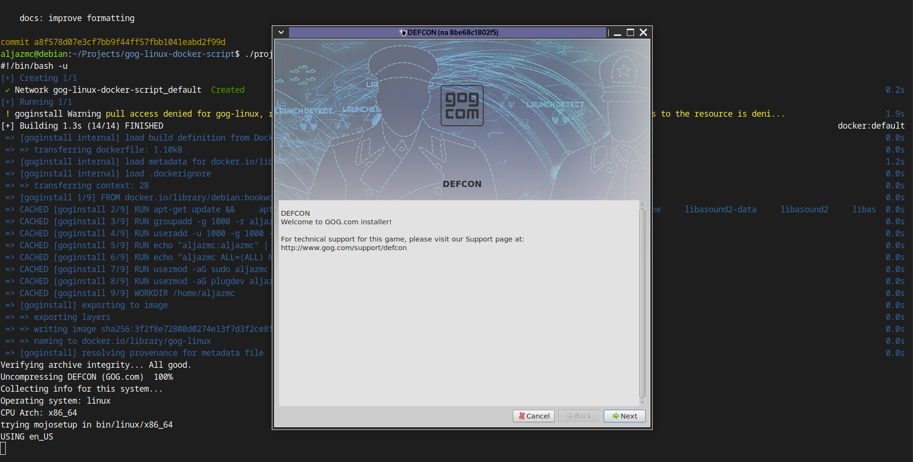

[](LICENSE)

# gog-linux-docker-script

A script for running GOG game in a Docker container.  
&nbsp;

&nbsp;

## > Description

This script creates Docker container to run GOG games, providing isolation and dependency management. Each game runs in its own container with the necessary runtime environment.
&nbsp;

&nbsp;

## > Concise Instructions

### Start
1. Copy one GOG game for GNU/Linux OS (with DLCs) in the project folder,
2. move to the project folder and
3. run './project.sh start'.

> [!CAUTION]
> You can put only one game (with all DLCs and extras) in the project folder.

### Remove generated files and folders
1. Clean up with './project.sh clean'.
&nbsp;

&nbsp;

## > Prerequisites

* Linux system with bash shell
* Docker (with docker compose plugin) installed and running
&nbsp;

&nbsp;

## > Example Use

```
## > clone the project
git clone https://github.com/aljazmc/gog-linux-docker-script

## > rename the downloaded folder
rename gog-linux-docker-script game

## > move GOG game (for Linux OS) with all DLCs to the 'game' directory
mv location/of/the/game-executable.sh game

## > move to the 'game' directory
cd game

## > run project.sh start. This will:
## 1.) generate configuration files and folders
## 2.) search for the game and DLCs inside the 'game' folder
## 3.) install the game and DLCs at default location (you'll need to confirm it manually!)
## 4.) start the game
./project.sh start

## > clean everything generated by the project.sh
./project.sh clean
```
&nbsp;

&nbsp;

## > Functions

> * Function `./project.sh start`:
>   * generate necessary Dockerfile, docker-compose.yml, other scripts and folders
>   * search for all '.sh' files in the folder and run their installers
>   * after everything is installed, it starts the game

> * Function `./project clean`:
>   * remove everything generated with `./project start`
&nbsp;

&nbsp;

## > Printscreen

Install screen for DEFCON:

&nbsp;

&nbsp;

